# System Architecture & Technical Specification: PWD BUPCA Inc. Platform

**Client:** PWD BUPCA Inc. (Persons with Disabilities - Barangay UP Campus Association)  
**Advocacy Context:** Community empowerment, livelihood programs (upcycled eco-bags, textile crafts, high-speed industrial machine production), UP Gawad Tsanselor Natatanging Lingkod Komunidad awardee.  
**Tech Stack:** Next.js 16 (App Router, TypeScript), Tailwind CSS v4, Plus Jakarta Sans & Newsreader typography, Leaflet / OpenStreetMap, Radix UI & Lucide React, Supabase (PostgreSQL + PostGIS + Realtime + Auth + Storage), Vercel.

---

## 1. Executive Summary & Core Objectives

The platform provides a dual-facing solution built with an **accessibility-first** and **clean editorial design**:
1. **Public Web Portal & Mini Virtual Store:**
   - Highlights PWD BUPCA’s advocacy for **"Persons with Determination"**, Gawad Tsanselor recognition, UP College of Home Economics (UP CHE) partnerships, and member testimonials.
   - Showcases authentic sustainable handcrafted goods (upcycled denim totes, storage baskets, pouches, and work aprons).
   - Features an accessible shopping cart and 2-step checkout supporting GCash, BPI UP Campus bank transfer, and Cash on Pickup.
2. **Accessible Main Command Center (Admin, Staff & Superuser):**
   - **Modern Sidebar Architecture:** Clean, user-friendly sidebar navigation categorizing Operations, Publishing CMS, and Developer Tools.
   - **Asset Operations Monitor & Stationary Interactive Map (2a):** OpenStreetMap/Leaflet integration pinpointing UP Diliman workshops (*UP CHE Workshop*, *Area 2 Community Center*, *BUPCA Hub*), live machine operational status, relocation tracker, and Asset-Linked DTR check-in.
   - **Supplies Basic Ordering System (2b):** Catalog of 100% organization-subsidized raw materials (denim scraps, heavy thread, zippers, woven labels) with member allocation requests and admin approval queue.
   - **Shopping Command Center (2c):** Live customer order pipeline (`pending` $\rightarrow$ `in_production` $\rightarrow$ `ready_for_pickup` $\rightarrow$ `completed`) with customer contact details and gross revenue metrics.
   - **Accounting & Labor Payroll (2d):** Transparent compensation engine calculating net payouts from station DTR units and supervised hours, complete with printable official artisan pay statements.
   - **Website Content Manager (CMS):** Customization suite allowing non-technical staff to update landing page headlines, mission/vision statements, public impact statistics, and partner banners without touching code.
   - **Developer & Master Database Module:** Master CRUD interface for configuring raw records across machinery, member/user profiles (with disability classifications), store catalog items, and raw inventory supplies.

---

## 2. Design System & Accessibility Engineering (WCAG 2.1 AA/AAA)

1. **Light & Dark Theme Switcher:**
   - Dedicated Sun/Moon toggle button in the top navigation and sidebar.
   - Configured with Tailwind CSS v4 `@custom-variant dark` and inline theme initialization script to prevent page flicker.
   - Persisted in browser `localStorage`.
2. **Approachable Human Typography:**
   - **Primary Interface:** [Plus Jakarta Sans](https://fonts.google.com/specimen/Plus+Jakarta+Sans) (warm, clear, human-designed geometric grotesque).
   - **Storytelling Editorial Serif:** [Newsreader](https://fonts.google.com/specimen/Newsreader) (used for narrative emphasis and artisan testimonials).
3. **Floating Accessibility Control Center (`AccessibilityToolbar.tsx`):**
   - **High Contrast Themes:** Standard mode, High-Contrast Black & Yellow (low vision / macular degeneration standard), and Pure Dark.
   - **Text Size Scaling:** 100%, 125%, and 150% dynamic zoom without layout breaking.
   - **Dyslexia Font Mode:** Expanded kerning and distinct letter distinction.
   - **Audio Cues & Voice Feedback:** Web Audio oscillator chimes on DTR logs, checkout, and CRUD actions, plus Text-to-Speech vocal briefings.
   - **Keyboard First:** High-contrast `focus-visible` indicators and an explicit `#main-content` skip link.

---

## 3. Database Entity Relationship (Supabase / PostgreSQL)

```mermaid
erDiagram
    PROFILES ||--o{ ASSET_LOGS : "logs DTR"
    PROFILES ||--o{ SUPPLY_REQUESTS : "requests"
    PROFILES ||--o{ PAYROLL_RECORDS : "earns"
    
    ASSETS ||--o{ ASSET_LOGS : "operated at"
    ASSETS }|--|| LOCATIONS : "currently stationed at"
    
    SUPPLIES ||--o{ SUPPLY_REQUESTS : "itemized in"
    
    PRODUCTS ||--o{ ORDER_ITEMS : "contains"
    ORDERS ||--o{ ORDER_ITEMS : "has"
    PROFILES ||--o{ ORDERS : "managed by"
    
    PROFILES {
        uuid id PK
        string full_name
        string disability "Visual | Hearing | Physical/Motor | Speech | Cognitive | None"
        string role "superuser | admin | member_operator | customer"
        string phone
        boolean active_status
    }

    LOCATIONS {
        uuid id PK
        string name "UP CHE Workshop, Area 2 Center, PWD BUPCA Hub"
        decimal latitude
        decimal longitude
        text address
        string contact_person
    }

    ASSETS {
        uuid id PK
        string asset_tag "BUPCA-SEW-01, BUPCA-EDGE-01"
        string name "Juki High-Speed Lockstitch #1"
        string category "High-Speed Sewing Machine | Edging Machine | Cutting Table"
        uuid location_id FK
        string status "online | idle | maintenance | offline"
        text specifications
    }

    ASSET_LOGS {
        uuid id PK
        uuid member_id FK
        uuid asset_id FK
        timestamp clock_in
        timestamp clock_out
        decimal duration_hours
        jsonb materials_consumed "e.g. { 'denim_meters': 3.0 }"
        integer units_produced "e.g. 12 eco-totes"
        text remarks
    }

    SUPPLIES {
        uuid id PK
        string name "Upcycled Denim Scraps, Heavy Duty Thread"
        string unit "meters, spools, pieces"
        integer current_stock
        integer min_threshold
        boolean is_subsidized
    }

    SUPPLY_REQUESTS {
        uuid id PK
        uuid member_id FK
        uuid supply_id FK
        integer quantity_requested
        string purpose
        string status "pending | approved | fulfilled | rejected"
        date request_date
    }

    PRODUCTS {
        uuid id PK
        string name "Signature Denim Eco-Tote"
        text description
        decimal price
        integer stock
        string image_url
        string artisan_name
        string materials_used
    }

    ORDERS {
        uuid id PK
        string order_number "BUPCA-2026-089"
        string customer_name
        string customer_phone
        text delivery_address
        decimal total_amount
        string status "pending | in_production | ready_for_pickup | completed"
        string payment_method "GCash | Bank Transfer | Cash on Pickup"
    }

    PAYROLL_RECORDS {
        uuid id PK
        uuid member_id FK
        string pay_period
        decimal hours_worked
        decimal hourly_allowance
        integer units_produced
        decimal piece_rate_earnings
        decimal materials_subsidized_value
        decimal net_payout
        string status "draft | approved | disbursed"
    }
```



---

## 4. Module Specifications

### Module 1: Public Web Portal & Mini Virtual Store (`/`, `/store`, `/programs`)
- **Advocacy & Landing Page (`/`):** Hero section with human editorial typography, UP Gawad Tsanselor badge, circular craftsmanship pillars, verified community metrics, and authentic artisan testimonials.
- **Livelihood Trainings (`/programs`):** Detailed breakdown of accredited skills training (industrial lockstitch, overlock edging, zero-waste cutting) in partnership with UP CHE and UP College of Fine Arts.
- **Mini Virtual Store (`/store`):**
  - Category filters (*Upcycled Eco-Bags*, *Fabric Baskets*, *Denim Pouches*, *Home Crafts*).
  - Product preview modal with artisan stories and sustainable material disclosures.
  - Slide-over shopping cart and 2-step checkout with GCash, Bank Transfer, and Cash on Pickup.

### Module 2: Main Command Center (`/admin`)

Organized with a dedicated, responsive **Sidebar Navigation**:

#### 2a. Asset Operations & Interactive Map Tracker
- **Leaflet / OpenStreetMap Integration:** Live visual map of UP Diliman workshop buildings with interactive pins.
- **Stationary Asset Monitoring:** Tracks machine status (*Online / In Production*, *Idle / Standby*, *Maintenance Check*).
- **Asset-Linked DTR Check-In:** Members clock in at their assigned machinery, recording hours worked, fabric meters consumed, and finished units produced.
- **Relocation Tracker:** Records machine transfers between workshop hubs with reason and date logging.
- **View Mode Switcher:** Instant toggle between interactive Map View and Grid Cards.

#### 2b. Supplies Inventory & Ordering System
- Subsidized raw materials catalog with real-time stock counters and low-inventory alerts.
- Big-touch request form for artisans to requisition production materials.
- Admin approval queue for 1-click supply release.

#### 2c. Shopping Hub & Orders
- Order processing board with status transitions (`pending` $\rightarrow$ `in_production` $\rightarrow$ `ready_for_pickup` $\rightarrow$ `completed`).
- Customer delivery info and revenue tracking directly tied to member wages.

#### 2d. Accounting & Member Payroll (Varied Product Releases & Auto-Computation)
- **Varied Product Output Tracking:** Tracks actual, itemized finished goods released per artisan across diverse product categories:
  - *BUPCA Signature Denim Tote Bags* (Piece-rate: ₱75/unit)
  - *Handcrafted Foldable Bread & Storage Baskets* (Piece-rate: ₱55/unit)
  - *Compact Multi-Compartment Denim Utility Pouches* (Piece-rate: ₱45/unit)
  - *Community Canvas Patchwork Aprons* (Piece-rate: ₱85/unit)
- **Automated Mathematical Computation Engine:**
  $$\text{Hourly Allowance} = \text{Monitored DTR Hours} \times \text{Hourly Rate (₱85/hr)}$$
  $$\text{Total Piece-Rate Earnings} = \sum_{i} (\text{Units Produced}_i \times \text{Item Piece Rate}_i)$$
  $$\text{Gross Labor Earnings} = \text{Hourly Allowance} + \text{Total Piece-Rate Earnings}$$
  $$\text{Net Artisan Take-Home} = \text{Gross Labor Earnings} + \text{Incentives/Bonus}$$
  *(Raw material costs are 100% subsidized by PWD BUPCA grants and institutional donors; ₱0 deducted from artisan earnings).*
- **Auto-Compute Batch Modal:** Allows supervisors to choose an artisan, set monitored workshop hours, add varied product rows with dynamic multipliers, and preview the live net take-home before generating records.
- **DTR Integration:** Automatically pulls logged product type, unit output, and piece-rate credit from station clock-in events into draft payroll records.
- **Transparent Pay Slips:** Printable official statements itemizing varied products released, hourly allowances, grant subsidies, and net earnings.

#### 2e. Website Content Manager (CMS with Full CRUD across 5 Sub-Tabs)
- **Tab 1: Landing Page & Storytelling:**
  - Hero headline prefix, italic serif accent, and narrative subtitle.
  - UP Gawad Tsanselor 2025 recognition notices.
  - Organization Mission and Vision statements.
  - Public impact metrics (*100% PWD Artisan Made*, *2.4+ Tons Fabric*, *3 Workshop Hubs*).
  - Corporate B2B and institutional partnership callouts.
- **Tab 2: Livelihood Programs (Full CRUD):**
  - Create, Read, Update, and Delete vocational curricula displayed on `/programs`.
  - Configurable title, institutional academic partner (*e.g., UP CHE, UP Fine Arts*), overview description, deliverables tags, cohort duration, and seat capacity.
- **Tab 3: Community Artisan Profiles (Full CRUD):**
  - Create, Read, Update, and Delete public artisan profiles on `/community`.
  - Configurable artisan name, determination title (*e.g. Master Sewing Artisan with Hearing Determination*), bio story, primary craft skills, workshop hub, years with BUPCA, featured status, and explicit **DPA RA 10173 Informed Consent Verification toggle**.
- **Tab 4: News Bulletins & Events (Full CRUD):**
  - Create, Read, Update, and Delete bulletins displayed on `/news`.
  - Configurable category (*Milestone, Event, Training, Partnership, Advocacy*), publication date, title, excerpt, full body text, location tag, and author.
- **Tab 5: Artisan Store Catalog (Full CRUD):**
  - Create, Read, Update, and Delete products displayed on `/store` and landing showcase.
  - Configurable retail price, stock inventory, artisan attribution, waste-reduction materials, photos, featured toggle, and **labor piece-rate** (auto-synchronized with Accounting & Payroll).
- Direct preview navigation links to `/`, `/programs`, `/community`, `/news`, and `/store`.

#### 2f. Public News & Events Portal (`/news`)
- Interactive public bulletin board with category filters (`All`, `Milestones`, `Events`, `Training`, `Partnerships`, `Advocacy`).
- Top featured story card with high-impact visual presentation.
- Interactive modal reader with full story details and social sharing context.
- Embedded Data Privacy Act (RA 10173) transparency disclosure informing visitors of journalistic ethics and consent-backed reporting.

#### 2g. PWD Community Members & Artisan Showcase (`/community`)
- Ethical empowerment directory celebrating the talents, craft competencies, and resilience of BUPCA artisans.
- Filterable by craft competency (*Industrial Lockstitch, Patchwork & Quilting, Quality Control, Loom Weaving*).
- Interactive story drawer modal highlighting personal vocational journey, favorite creations, and direct links to order their handcrafted items.
- Strict adherence to Philippine Data Privacy Act (RA 10173): displays voluntary informed consent verification badges, omits clinical medical records, and keeps all personal contact info strictly confidential.

#### 2h. Statutory Legal Disclosures & Whitepapers
- **Data Privacy Disclosure (`/privacy`):** Comprehensive policy under Republic Act No. 10173 and National Privacy Commission (NPC) circulars. Outlines legitimate purpose, proportionality, 6 statutory data subject rights (access, rectification, erasure, damages, data portability, complaint filing), data minimization on sensitive personal information (disability status), and DPO contact details.
- **Terms of Service (`/terms`):** Detailed agreement governing circular economy upcycled handcrafted goods, artisan piece-rate transparency, fair-trade social enterprise standards, B2B corporate commissions, and payment procedures (GCash, BPI UP Campus, Cash on Pickup).

#### 2i. Developer & Master Database Module
- Centralized CRUD management interface categorized into:
  - **Machinery & Assets:** Tag, name, category, workshop location, specs, status.
  - **Members & Users:** Name, role (*Member Operator, Admin, Superuser*), disability group, contact phone.
  - **Store Catalog:** Product name, price, stock quota, artisan attribution, materials, photo.
  - **Supplies Stock:** Item name, category, stock, unit, threshold, subsidies.

---

## 5. Local Running & Deployment Guide

```bash
# Navigate to the Next.js project
cd pwd-bupca-app

# Install dependencies (if fresh clone)
npm install

# Start development server
npm run dev

# Build for production
npm run build
```

- **Master Presentation Overview:** Comprehensive deck for sponsors, public, and community in [`OVERVIEW.md`](./OVERVIEW.md).
- **Database:** Deploy schema using [`supabase_schema.sql`](./supabase_schema.sql) in your Supabase SQL Editor.
- **Client Onboarding Template:** Collect real production data using [`CLIENT_DATABASE_TEMPLATE.md`](./CLIENT_DATABASE_TEMPLATE.md).
- **Hosting:** Ready for zero-config deployment on **Vercel**.
